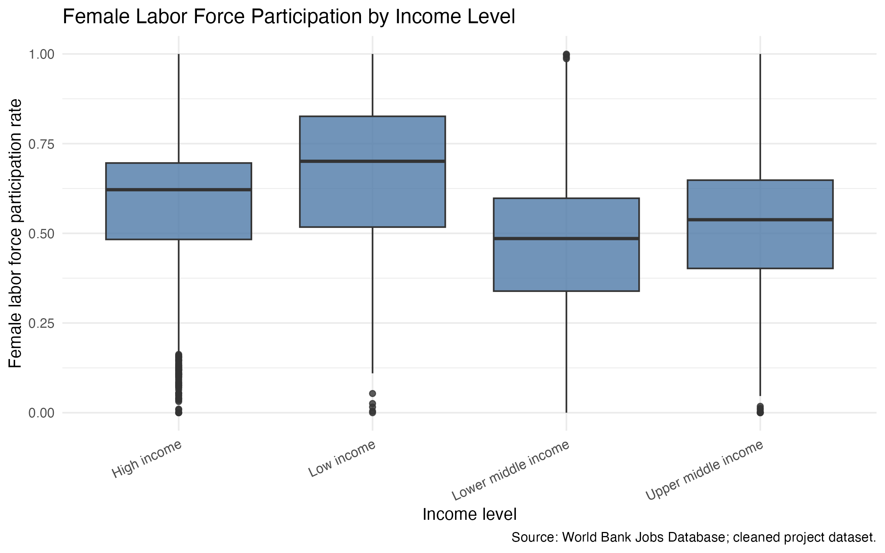
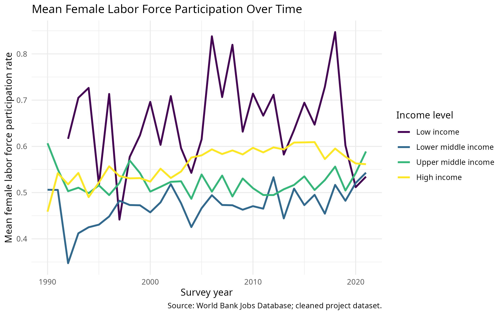
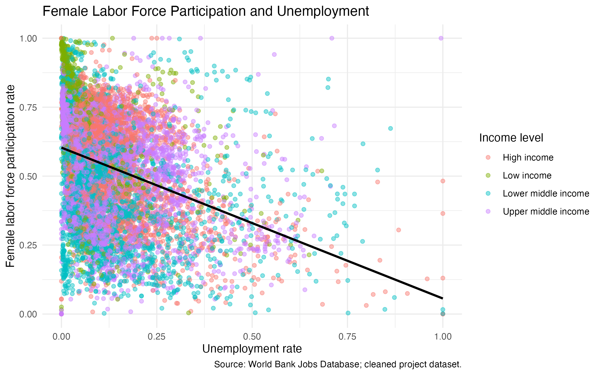

## Dataset

We use the **Global Jobs Indicators Database** from the World Bank. The dataset contains labour market indicators for different countries, income groups, subsamples, and survey years.

Our project focuses on **Female Labor Force Participation**, especially how it differs across countries, income levels, urban/rural residence, and over time.

Key variables for our initial analysis are renamed in the cleaned dataset as follows:

* `flfp`: Female labor force participation rate, aged 15–64
* `income_level`: World Bank income group
* `region`: Region code
* `subsample`: Population subgroup, such as urban/rural
* `year`: Year of survey
* `unemployment`: Unemployment rate, aged 15–64
* `female_non_agri`: Female employment in non-agricultural sectors, aged 15–64
* `avg_weekly_hours`: Average weekly working hours

The raw import contained 14,628 rows. After removing 1,934 observations with missing female labor force participation, excluding no additional rows with missing survey year, and restricting the sample to surveys from 1990 onward, 12,357 rows remained; this removed 2,271 rows in total. Because `flfp` is the main outcome variable, rows without this value could not contribute to the analysis. The year restriction focuses the project on more recent labour market patterns and reduces sparse coverage in earlier periods. Missingness may not be random, so the results should be interpreted as applying to the retained observations.

## Research Questions

1. **How does female labor force participation vary across income groups, urban/rural populations, and survey years?**

2. **How is female labor force participation associated with unemployment, female non-agricultural employment, and average weekly working hours?**

## Initial EDA

The initial exploratory data analysis uses the cleaned dataset `data/processed/jobs_clean.csv`. The summary tables and figures are generated by `code/03_eda.R`, including summaries by income group, subsample, and year-income group in `data/processed/`.

This boxplot shows the distribution of female labor force participation across income groups. It relates to the first research question by comparing patterns between income-level categories. The variation within each income group suggests that the next analysis should report both grouped summaries and within-group spread, rather than relying only on averages.

This line plot shows mean female labor force participation across survey years by income group. It supports the first research question by showing exploratory time patterns and how these patterns differ across income levels. The plot suggests that the next analysis should summarize year-income trends carefully, because survey coverage can vary across years.

This scatterplot shows how female labor force participation is associated with unemployment, with observations coloured by income group. It relates to the second research question by giving an exploratory view of the relationship between participation and a key labour market indicator. The pattern cannot be interpreted causally, so the next analysis should describe associations cautiously and compare them with female non-agricultural employment and average weekly working hours.

## Analysis Plan

To answer the first research question, we will analyse how female labor force participation differs across income groups, subsamples, and survey years. We will first clean the dataset by selecting the relevant variables, filtering observations with missing female labor force participation values, and restricting the analysis to usable survey years. We will then compute grouped summary statistics, such as the mean female labor force participation rate by year, income group, and subsample. These results will be visualised using line charts and grouped comparisons to show broad trends over time and differences between income groups and urban/rural populations.

To answer the second research question, we will explore how female labor force participation is associated with selected labour market indicators. The main explanatory variables are unemployment rate, female employment in non-agricultural sectors, and average weekly working hours. We will use scatterplots and correlation-based summaries to inspect the relationships between these variables. In addition, we will fit a simple linear regression model with female labor force participation as the outcome variable and the selected labour market indicators as predictors. This model is used for exploratory interpretation, not for causal claims or prediction.

The core analysis is therefore focused on two outputs: first, visualisations and summary tables showing differences in female labor force participation across income groups, subsamples, and years; second, exploratory association results showing how female labor force participation relates to unemployment, female non-agricultural employment, and average weekly working hours.

The remaining work before the final submission is to improve the visual presentation of the plots, format the summary tables and model results clearly, write a careful interpretation of the findings, and polish the Quarto website. Potential limitations are that important social and cultural factors such as childcare policies, gender roles, education systems, religion, and political institutions are not directly included in the dataset. Therefore, our analysis can describe patterns and associations, but it cannot fully explain the causes of differences in female labor force participation.
